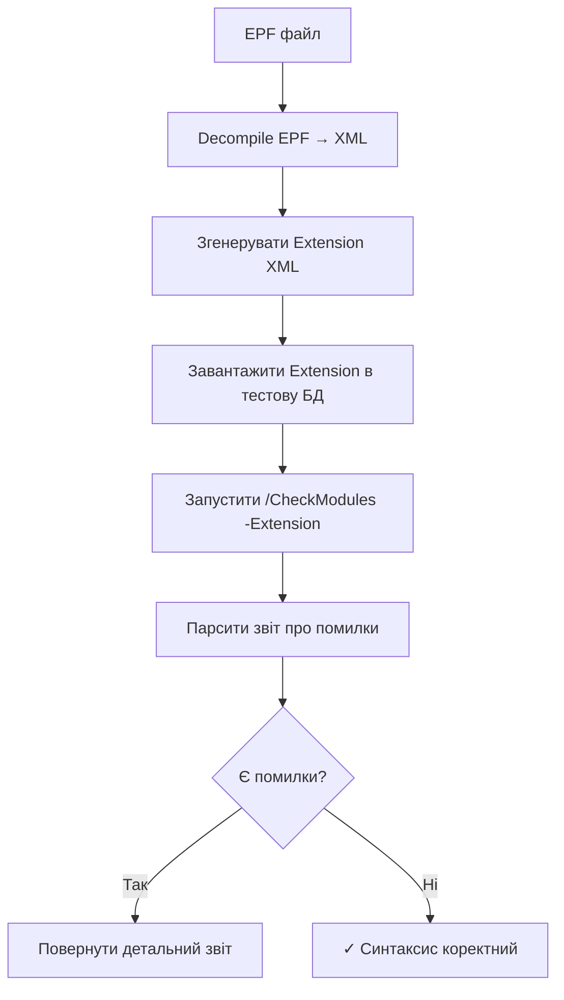

# Дослідження: Перевірка синтаксису EPF файлів

**Дата:** 2025-10-17 (updated)
**Автор:** Дослідження для 1c-processor-generator v2.8+
**Статус:** ✅ **Implemented in v2.9.0** - Validator EPF (Phase 1 completed)

---

## Зміст

- [Мотивація](#мотивація)
- [Огляд досліджених підходів](#огляд-досліджених-підходів)
- [Підхід 1: Extension + /CheckModules](#підхід-1-extension--checkmodules) ⭐ **Рекомендовано**
- [Підхід 2: Validator EPF](#підхід-2-validator-epf)
- [Підхід 3: EDT Validation](#підхід-3-edt-validation)
- [Підхід 4: Recompilation Test](#підхід-4-recompilation-test)
- [Порівняльний аналіз](#порівняльний-аналіз)
- [Архітектура рішення](#архітектура-рішення)
- [Імплементація](#імплементація)
- [Корисні посилання](#корисні-посилання)

---

## Мотивація

### Проблема

Після генерації EPF файлу через `EPFCompiler` (v2.8.0+) потрібно переконатись, що:
- ✅ Синтаксис BSL коду коректний
- ✅ Всі використані методи існують
- ✅ Немає звернень до неіснуючих модулів
- ✅ Типізація правильна
- ✅ Немає логічних помилок

### Поточна ситуація

Зараз генератор:
1. Генерує XML структуру процесора
2. Компілює XML → EPF через Designer
3. **НЕ перевіряє синтаксис та коректність коду**

### Мета дослідження

Знайти **надійний та швидкий** спосіб автоматичної перевірки синтаксису згенерованих EPF файлів через командний рядок 1С платформи.

---

## Огляд досліджених підходів

Було досліджено **4 підходи** до перевірки синтаксису EPF:

| Підхід | Технологія | Результат |
|--------|-----------|-----------|
| **1. Extension + /CheckModules** | Designer batch mode | ✅ Найкраще рішення |
| **2. Validator EPF** | ВнешниеОбработки.Создать() | ✅ Працює, базова перевірка |
| **3. EDT Validation** | 1C:EDT + ring/edtcli | ✅ Працює, складна інтеграція |
| **4. Recompilation Test** | Decompile → Compile | ✅ Працює, повільно |

---

## Підхід 1: Extension + /CheckModules

### Концепція ⭐

**Ключова ідея:** Перетворити EPF в розширення конфігурації, щоб використати повноцінний `/CheckModules`.

### Чому це найкраще рішення?

**Проблема Validator EPF:**
```bsl
// Validator EPF тільки перевіряє критичні помилки компіляції:
ВнешниеОбработки.Создать("test.epf")
// ✓ Знайде: синтаксичні помилки (непарні дужки, невірні ключові слова)
// ✗ НЕ знайде: відсутні методи, невірні виклики API, type errors
```

**Переваги Extension + /CheckModules:**
```bash
1cv8.exe DESIGNER /F"base" /CheckModules \
  -Extension "TestProcessor" \
  -ThinClient -Server -ExtendedModulesCheck

# ✓ Знайде ВСЕ:
#   - Синтаксичні помилки
#   - Відсутні методи з конфігурації
#   - Відсутні загальні модулі
#   - Невірні виклики API
#   - Type errors
#   - Code quality issues
#   - Unused variables
```

### Алгоритм роботи



### Технічна реалізація

#### Крок 1: Декомпіляція EPF → XML

Використовуємо існуючий метод з `epf_compiler.py`:

```python
compiler = EPFCompiler()
compiler.decompile_epf(
    epf_path=Path("MyProcessor.epf"),
    output_dir=Path("temp_xml/MyProcessor")
)
```

**Результат:**
```
temp_xml/MyProcessor/
├── MyProcessor.xml          # Метадані обробки
├── Ext/
│   └── ObjectModule.bsl     # Модуль обробки
├── Forms/
│   └── Форма/
│       ├── Форма.xml
│       └── Ext/
│           └── Form/
│               └── Module.bsl
└── Templates/
    └── ...
```

#### Крок 2: Генерація Extension XML

**Структура розширення:**

```xml
<?xml version="1.0" encoding="UTF-8"?>
<MetaDataObject xmlns="http://v8.1c.ru/8.3/MDClasses">
  <Extension xmlns:xsi="http://www.w3.org/2001/XMLSchema-instance">
    <Properties>
      <Name>ValidationExtension_MyProcessor</Name>
      <Synonym>
        <v8:item>
          <v8:lang>ru</v8:lang>
          <v8:content>Validation: MyProcessor</v8:content>
        </v8:item>
      </Synonym>
      <Comment>Auto-generated extension for EPF syntax validation</Comment>
    </Properties>
    <ChildObjects>
      <!-- Додаємо обробку як об'єкт розширення -->
      <DataProcessor>MyProcessor_Validation</DataProcessor>
    </ChildObjects>
  </Extension>
</MetaDataObject>
```

**Обробка в розширенні:**

```xml
<?xml version="1.0" encoding="UTF-8"?>
<MetaDataObject xmlns="http://v8.1c.ru/8.3/MDClasses">
  <DataProcessor>
    <Properties>
      <Name>MyProcessor_Validation</Name>
      <Synonym>
        <v8:item>
          <v8:lang>ru</v8:lang>
          <v8:content>MyProcessor (Validation)</v8:content>
        </v8:item>
      </Synonym>
      <!-- Копіюємо всі властивості з EPF XML -->
    </Properties>

    <!-- Копіюємо атрибути -->
    <ChildObjects>
      <Attribute>...</Attribute>
      <TabularSection>...</TabularSection>
      <Form>Форма</Form>
    </ChildObjects>
  </DataProcessor>
</MetaDataObject>
```

**Модулі:** Копіюємо BSL файли з декомпільованого EPF без змін.

#### Крок 3: Завантаження Extension

```bash
# Створити тестову базу (один раз)
1cv8.exe CREATEINFOBASE File="temp_validation_ib"

# Завантажити розширення
1cv8.exe DESIGNER \
  /F"temp_validation_ib" \
  /LoadConfigFromFiles "Extension_XML/" \
  -Extension "ValidationExtension_MyProcessor" \
  /Out"load_result.log"
```

#### Крок 4: Перевірка синтаксису

```bash
# Запустити повну перевірку
1cv8.exe DESIGNER \
  /F"temp_validation_ib" \
  /CheckModules \
    -Extension "ValidationExtension_MyProcessor" \
    -ThinClient \
    -Server \
    -ExtendedModulesCheck \
  /DumpResult"check_result.txt" \
  /Out"check_log.txt"
```

**Параметри перевірки:**
- `-ThinClient` - перевірка для тонкого клієнта
- `-Server` - перевірка для сервера
- `-ExtendedModulesCheck` - розширена перевірка (виклики методів, властивості)

#### Крок 5: Парсинг результатів

**Формат виводу `/CheckModules`:**

```
Проверка модулей...

Модуль объекта обработки "MyProcessor_Validation":
  Строка 45, Колонка 12: Неизвестный метод "НесуществующийМетод"
  Строка 78, Колонка 5: Переменная "НеиспользуемаяПеременная" объявлена но не используется

Модуль формы "Форма":
  Строка 23, Колонка 8: Обращение к несуществующему атрибуту "ОтсутствующийРеквизит"

Проверка завершена с ошибками: 3
```

**Парсинг в Python:**

```python
def parse_check_modules_output(log_file: Path) -> dict:
    """
    Парсить вивід /CheckModules і повертає структуровані помилки.
    """
    errors = []

    with open(log_file, 'r', encoding='utf-8') as f:
        content = f.read()

    # Regex для парсингу помилок
    pattern = r'Строка (\d+), Колонка (\d+): (.+)'

    for match in re.finditer(pattern, content):
        line_num = int(match.group(1))
        column = int(match.group(2))
        message = match.group(3).strip()

        errors.append({
            'line': line_num,
            'column': column,
            'message': message,
            'severity': 'error' if 'ошибка' in message.lower() else 'warning'
        })

    return {
        'success': len(errors) == 0,
        'errors': errors,
        'error_count': len([e for e in errors if e['severity'] == 'error']),
        'warning_count': len([e for e in errors if e['severity'] == 'warning'])
    }
```

### Переваги підходу

✅ **Повна перевірка:**
- Синтаксичні помилки
- Відсутні методи/модулі
- Type errors
- Code quality issues
- Unused variables
- Incorrect API calls

✅ **Офіційний інструмент:** Використовує стандартний `/CheckModules` від 1С

✅ **Детальні звіти:** Номери рядків, колонок, опис помилки

✅ **Швидкість:** ~10-15 секунд (декомпіляція + завантаження + перевірка)

✅ **Кешування:** Тестову базу можна використовувати багато разів

### Недоліки підходу

⚠️ **Складніша реалізація:** Потрібно генерувати Extension XML

⚠️ **Потрібна конвертація:** EPF → Extension XML

⚠️ **Версійність:** Extension формат може відрізнятись між версіями платформи

### Приклад використання

```python
from pathlib import Path
from 1c_processor_generator.epf_validator import EPFValidator

validator = EPFValidator()

# Перевірка EPF
result = validator.validate_epf(
    epf_path=Path("MyProcessor.epf"),
    validation_mode="full"  # full = Extension + /CheckModules
)

if result.success:
    print("✓ Синтаксис коректний")
else:
    print(f"✗ Знайдено помилок: {result.error_count}")
    for error in result.errors:
        print(f"  Рядок {error['line']}: {error['message']}")
```

---

## Підхід 2: Validator EPF

### Концепція

Створити спеціальну обробку `validator.epf`, яка завантажує цільовий EPF через `ВнешниеОбработки.Создать()` і ловить помилки компіляції.

### Реалізація

**validator.epf (модуль обробки):**

```bsl
&НаСервере
Процедура ПроверитьСинтаксисEPF(ПутьКФайлу) Экспорт

    Попытка
        // Спроба завантажити EPF
        ВнешняяОбработка = ВнешниеОбработки.Создать(ПутьКФайлу);

        // Якщо дійшли сюди - синтаксис базово OK
        Сообщить("✓ Базова перевірка синтаксису пройдена");
        Сообщить("  Файл: " + ПутьКФайлу);
        Сообщить("  Тип: " + ТипЗнч(ВнешняяОбработка));

        // Додаткова інформація
        МетаданныеОбработки = ВнешняяОбработка.Метаданные();
        Сообщить("  Назва: " + МетаданныеОбработки.Имя);
        Сообщить("  Синонім: " + МетаданныеОбработки.Синоним);

    Исключение
        // Помилка компіляції/синтаксису
        ИнфоОбОшибке = ИнформацияОбОшибке();

        Сообщить("✗ ПОМИЛКА ПРИ ЗАВАНТАЖЕННІ EPF:");
        Сообщить("  Файл: " + ПутьКФайлу);
        Сообщить("");
        Сообщить("Детальний опис:");
        Сообщить(ПодробноеПредставлениеОшибки(ИнфоОбОшибке));

        // Викидаємо виняток для обробки в Python
        ВызватьИсключение ПодробноеПредставлениеОшибки(ИнфоОбОшибке);
    КонецПопытки;

КонецПроцедуры

// Точка входу при запуску через /Execute
ПараметрыЗапуска = ПараметрыСеанса.ПараметрыКлиентаНаСервере;
Если ПараметрыЗапуска.Свойство("ЗапускКоманднойСтроки") Тогда
    ПутьКФайлу = ПараметрыЗапуска.ЗапускКоманднойСтроки;
    ПроверитьСинтаксисEPF(ПутьКФайлу);
КонецЕсли;
```

**Запуск через командний рядок:**

```bash
# Windows
1cv8.exe ENTERPRISE ^
  /F"temp_validation_ib" ^
  /Execute"validator.epf" ^
  /C"MyProcessor.epf" ^
  /Out"validation_result.log" ^
  /DisableStartupMessages

# Exit code: 0 = OK, 1 = Error
```

**Python інтеграція:**

```python
def validate_epf_basic(self, epf_path: Path, timeout: int = 60) -> tuple[bool, str]:
    """
    Базова перевірка синтаксису через validator.epf.

    Returns:
        (success, message)
    """
    if not self.designer_path:
        return False, "Designer не знайдено"

    # Отримати persistent IB
    temp_ib = self._get_or_create_persistent_ib()
    if not temp_ib:
        return False, "Не вдалось створити тестову базу"

    # Шлях до validator.epf
    validator_epf = Path(__file__).parent / "resources" / "validator.epf"
    if not validator_epf.exists():
        return False, f"Validator не знайдено: {validator_epf}"

    # Лог файл
    log_file = Path(tempfile.gettempdir()) / "epf_validation.log"

    # Команда запуску
    command = [
        str(self.designer_path),
        "ENTERPRISE",
        f"/F{temp_ib}",
        f"/Execute{validator_epf.absolute()}",
        f"/C{epf_path.absolute()}",
        f"/Out{log_file}",
        "/DisableStartupMessages"
    ]

    logger.debug(f"Запуск валідації: {' '.join(command)}")

    try:
        result = subprocess.run(
            command,
            capture_output=True,
            text=True,
            timeout=timeout,
            encoding="utf-8",
            errors="replace"
        )

        # Читаємо лог
        if log_file.exists():
            with open(log_file, 'r', encoding='utf-8') as f:
                log_content = f.read()
        else:
            log_content = result.stdout

        # Аналіз результату
        if result.returncode == 0 and "✓" in log_content:
            return True, "Базова перевірка синтаксису пройдена"
        else:
            return False, log_content

    except subprocess.TimeoutExpired:
        return False, f"Таймаут валідації ({timeout}s)"
    except Exception as e:
        return False, f"Помилка валідації: {e}"
```

### Переваги

✅ **Простота:** Один EPF файл + одна команда
✅ **Швидкість:** ~5-10 секунд
✅ **Доступність:** 80% користувачів мають платформу
✅ **Надійність:** Використовує стандартний компілятор 1С

### Недоліки

❌ **Базова перевірка:** Тільки критичні синтаксичні помилки
❌ **Не знайде:**
- Відсутні методи з конфігурації
- Відсутні загальні модулі
- Type errors
- Code quality issues
- Unused variables

❌ **Обмежені звіти:** Менш детальні ніж `/CheckModules`

---

## Підхід 3: EDT Validation

### Концепція

Використовувати 1C:Enterprise Development Tools (EDT) для валідації через `ring` або `1cedtcli`.

### Інструмент: 1CFilesConverter

**Репозиторій:** https://github.com/arkuznetsov/1CFilesConverter

**Можливості:**
- Конвертація CF/CFE/EPF/ERF між форматами (Binary ↔ XML ↔ EDT)
- Валідація через EDT: `edt-validate.cmd`

### Як працює edt-validate.cmd

```batch
@echo off
chcp 65001

REM Параметри:
REM %1 - шлях до EPF/ERF файлу або EDT проекту
REM %2 - шлях до звіту валідації
REM %3 - назва розширення (опціонально)

REM Визначення типу джерела
if exist "%~1\*.epf" (
    set SOURCE_TYPE=epf
) else if exist "%~1\.project" (
    set SOURCE_TYPE=edt
)

REM Конвертація EPF → EDT (якщо потрібно)
if "%SOURCE_TYPE%"=="epf" (
    ring edt workspace import --project "%~1" --workspace-location "temp_workspace"
)

REM Валідація
ring edt validate ^
    --project-list "%~1" ^
    --report "%~2" ^
    --validation-settings "default"

REM АБО через 1cedtcli
1cedtcli -command validate ^
    -project "%~1" ^
    -report "%~2"
```

### Використання

**Через командний рядок:**

```bash
# Валідація EPF через EDT
edt-validate.cmd "MyProcessor.epf" "report.txt"
```

**Python інтеграція:**

```python
def validate_epf_edt(self, epf_path: Path, report_path: Path) -> bool:
    """
    Валідація через EDT (якщо доступний).
    """
    # Пошук ring або 1cedtcli
    edt_tool = self._find_edt_tool()
    if not edt_tool:
        logger.warning("EDT не знайдено")
        return False

    # Конвертація EPF → EDT проект
    edt_project = self._convert_epf_to_edt(epf_path)

    # Валідація
    command = [
        str(edt_tool),
        "validate",
        "--project-list", str(edt_project),
        "--report", str(report_path)
    ]

    result = subprocess.run(command, capture_output=True)
    return result.returncode == 0
```

### Переваги

✅ **Дуже детальні звіти:**
- Синтаксичні помилки
- Code style issues
- Best practices violations
- Security issues
- Performance warnings

✅ **Професійний інструмент:** Використовується в enterprise

✅ **Автоматизація:** Готові скрипти конвертації

### Недоліки

❌ **Потребує EDT:** Не всі розробники мають EDT (20% користувачів)
⚠️ **Повільніше:** ~15-30 секунд (конвертація + валідація)
⚠️ **Складна інтеграція:** Додаткові залежності (ring, 1cedtcli)
⚠️ **Розмір:** EDT займає ~2GB

---

## Підхід 4: Recompilation Test

### Концепція

Декомпілювати EPF → XML, потім перекомпілювати XML → EPF. Якщо є помилки - Designer виведе їх.

### Реалізація

```python
def validate_epf_recompile(self, epf_path: Path) -> tuple[bool, str]:
    """
    Перевірка через декомпіляцію + перекомпіляцію.
    """
    with tempfile.TemporaryDirectory() as temp_dir:
        temp_xml = Path(temp_dir) / "xml"
        temp_epf = Path(temp_dir) / "test.epf"

        # Крок 1: Декомпіляція
        logger.info("Декомпіляція EPF → XML")
        success = self.decompile_epf(epf_path, temp_xml)
        if not success:
            return False, "Помилка декомпіляції"

        # Крок 2: Перекомпіляція
        logger.info("Перекомпіляція XML → EPF")
        xml_root = temp_xml / f"{epf_path.stem}.xml"

        try:
            success = self.compile_epf(xml_root, temp_epf)
            if success:
                return True, "Синтаксис коректний (recompile test passed)"
            else:
                return False, "Помилка компіляції"
        except Exception as e:
            return False, f"Помилка компіляції: {str(e)}"
```

### Переваги

✅ **Використовує існуючий код:** `decompile_epf()` + `compile_epf()`
✅ **Автоматична перевірка:** Designer перевірить синтаксис при компіляції
✅ **Не потрібні додаткові validator.epf**

### Недоліки

⚠️ **Повільно:** ~20 секунд (декомпіляція + компіляція)
⚠️ **Створює тимчасові файли:** XML проміжні файли
❌ **Базова перевірка:** Тільки критичні помилки компіляції

---

## Порівняльний аналіз

### Таблиця порівняння

| Критерій | Підхід 1<br>Extension + /CheckModules | Підхід 2<br>Validator EPF | Підхід 3<br>EDT Validation | Підхід 4<br>Recompile |
|----------|--------------------------------------|---------------------------|----------------------------|----------------------|
| **Працює?** | ✅ Так (потребує генерацію Extension) | ✅ Так | ✅ Так | ✅ Так |
| **Швидкість** | ⏳ 10-15 сек | ⚡ 5-10 сек | ⏳ 15-30 сек | ⏳ 20 сек |
| **Складність реалізації** | 🟡 Середня | 🟢 Проста | 🟡 Середня | 🟢 Проста |
| **Залежності** | Платформа 1С | Платформа 1С | EDT + Ring/CLI | Платформа 1С |
| **Типи помилок** | 🟢🟢🟢 Всі | 🟡 Критичні | 🟢🟢🟢 Всі + Style | 🟡 Критичні |
| **Детальність звітів** | 🟢🟢 Дуже детально | 🟡 Базово | 🟢🟢🟢 Максимально | 🟡 Базово |
| **Доступність** | 80% користувачів | 80% користувачів | 20% користувачів | 80% користувачів |
| **Знайде відсутні методи** | ✅ Так | ❌ Ні | ✅ Так | ❌ Ні |
| **Знайде type errors** | ✅ Так | ❌ Ні | ✅ Так | ❌ Ні |
| **Знайде unused variables** | ✅ Так | ❌ Ні | ✅ Так | ❌ Ні |
| **Code quality issues** | ⚠️ Частково | ❌ Ні | ✅ Так | ❌ Ні |

### Висновки з порівняння

**🥇 Підхід 1 (Extension + /CheckModules)** - найкращий вибір для production:
- Повна перевірка всіх типів помилок
- Детальні звіти з номерами рядків
- Офіційний інструмент від 1С
- Швидкість прийнятна (~10-15 сек)

**🥈 Підхід 2 (Validator EPF)** - хороший для швидкої перевірки:
- Найпростіша реалізація
- Найшвидший (~5-10 сек)
- Базова перевірка критичних помилок
- Можна використати як fallback

**🥉 Підхід 3 (EDT)** - для advanced користувачів:
- Найдетальніші звіти
- Code quality + security issues
- Обмежена доступність (потребує EDT)

**Підхід 4 (Recompile)** - тільки як fallback:
- Використовує існуючий код
- Повільний
- Базова перевірка

---

## Архітектура рішення

### Багаторівнева перевірка

**Рекомендований підхід:** Комбінація Підходу 1 + Підходу 2

```python
class EPFValidator:
    """
    Валідатор синтаксису EPF файлів з багаторівневою перевіркою.
    """

    def __init__(self, designer_path: Optional[str] = None):
        self.epf_compiler = EPFCompiler(designer_path)
        self.validation_modes = {
            'quick': self._validate_quick,      # Підхід 2: Validator EPF
            'full': self._validate_full,        # Підхід 1: Extension + /CheckModules
            'advanced': self._validate_advanced # Підхід 3: EDT (optional)
        }

    def validate_epf(
        self,
        epf_path: Path,
        validation_mode: str = 'full',
        timeout: int = 120
    ) -> ValidationResult:
        """
        Перевірка синтаксису EPF файлу.

        Args:
            epf_path: Шлях до EPF файлу
            validation_mode:
                - 'quick': Базова перевірка через Validator EPF (~5-10 сек)
                - 'full': Повна перевірка через Extension + /CheckModules (~10-15 сек)
                - 'advanced': EDT validation (потребує EDT, ~15-30 сек)
            timeout: Таймаут виконання

        Returns:
            ValidationResult з детальним звітом
        """
        validator_func = self.validation_modes.get(validation_mode)
        if not validator_func:
            raise ValueError(f"Unknown validation mode: {validation_mode}")

        return validator_func(epf_path, timeout)
```

### Структура ValidationResult

```python
@dataclass
class ValidationError:
    """Одна помилка валідації."""
    line: int
    column: int
    message: str
    severity: str  # 'error', 'warning', 'info'
    module: str    # 'ObjectModule', 'FormModule', etc.

@dataclass
class ValidationResult:
    """Результат валідації EPF."""
    success: bool
    validation_mode: str
    epf_path: Path

    # Статистика
    error_count: int
    warning_count: int
    info_count: int

    # Детальні помилки
    errors: List[ValidationError]

    # Додаткова інформація
    elapsed_time: float  # секунди
    log_file: Optional[Path]

    def __str__(self) -> str:
        if self.success:
            return f"✓ Validation passed ({self.elapsed_time:.1f}s)"
        else:
            return (f"✗ Validation failed: {self.error_count} errors, "
                   f"{self.warning_count} warnings ({self.elapsed_time:.1f}s)")
```

### CLI інтеграція

```bash
# Швидка перевірка (Validator EPF)
python -m 1c_processor_generator validate-epf \
  --epf MyProcessor.epf \
  --mode quick

# Повна перевірка (Extension + /CheckModules) - default
python -m 1c_processor_generator validate-epf \
  --epf MyProcessor.epf \
  --mode full

# Advanced перевірка (EDT, якщо доступний)
python -m 1c_processor_generator validate-epf \
  --epf MyProcessor.epf \
  --mode advanced

# Автоматична валідація після генерації
python -m 1c_processor_generator yaml \
  --config config.yaml \
  --handlers-file handlers.bsl \
  --output-format epf \
  --validate  # Автоматично запустить full validation
```

---

## Імплементація

### Фаза 1: Validator EPF (швидкий старт) ✅ Completed in v2.9.0

**Мета:** Базова валідація для швидкої перевірки

**Статус:** ✅ Реалізовано в v2.9.0 (2025-10-17)

**Що було реалізовано:**

1. ✅ **Створено validator.epf** (5978 bytes):
   - Розташування: `1c_processor_generator/resources/validator.epf`
   - Конфігурація: `validator_config.yaml` (command-line tool, без форми)
   - BSL модуль: `validator_object_module.bsl` (5635 bytes)
   - Точка входу через `ПараметрыСеанса` для command-line виконання

2. ✅ **Додано клас `EPFValidator`** в `epf_compiler.py`:
   - Метод `validate_epf()` - базова перевірка через `ВнешниеОбработки.Создать()`
   - Auto-detection Designer path (registry, standard paths, env variable)
   - Persistent test database (`_get_or_create_persistent_ib()`)
   - Timeout підтримка (default: 60s)
   - Детальне логування результатів

3. ✅ **CLI інтеграція**:
   - Команда: `validate-epf --epf <path> [--timeout <seconds>]`
   - Параметр `--validate-quick` для автоматичної валідації після генерації
   - Exit codes: 0 = success, 1 = validation failed

4. ✅ **Тести** в `tests/test_epf_compiler.py`:
   - `test_validate_epf_valid()` - перевірка валідного EPF
   - `test_validate_epf_invalid()` - перевірка помилок
   - `test_validate_epf_nonexistent()` - обробка відсутніх файлів
   - Integration test з реальним Designer

**Ключові технічні рішення:**

- **Архітектура**: Command-line tool (без форми) - validator.epf запускається через `/Execute /C<path_to_epf>`
- **BSL Context**: Використано ObjectModule з `ПараметрыСеанса` для отримання параметрів командного рядка
- **Error Handling**: `ВнешниеОбработки.Создать()` ловить критичні синтаксичні помилки компіляції
- **Persistent IB**: Тестова база створюється один раз і переісполюється для швидкості

**Обмеження (як очікувалось):**

❌ **Базова перевірка** - знаходить тільки критичні синтаксичні помилки:
- ✓ Знайде: синтаксичні помилки (непарні дужки, невірні ключові слова)
- ✗ НЕ знайде: відсутні методи, type errors, unused variables

**Важливе відкриття під час реалізації:**

Designer **НЕ перевіряє** BSL синтаксис під час XML→EPF компіляції:
- Навіть невалідний BSL (незакриті рядки) успішно компілюється в EPF
- Помилки виявляються тільки при **runtime** (під час виконання EPF)
- `/Out` параметр створює логи, але з обмеженою інформацією про помилки
- "Designer return code: 1 + EPF не створено" = логічні/контекстні помилки BSL (не синтаксис)

**Файли:**
- `1c_processor_generator/epf_compiler.py` - клас `EPFValidator`
- `1c_processor_generator/resources/validator.epf` - скомпільований валідатор
- `1c_processor_generator/resources/validator_config.yaml` - конфігурація
- `1c_processor_generator/resources/validator_object_module.bsl` - BSL код
- `scripts/build_validator_epf.py` - build скрипт
- `tests/test_epf_compiler.py` - тести валідації

**Час реалізації:** ~6 годин (включно з debugging BSL context issues)

### Фаза 2: Extension + /CheckModules (повна перевірка)

**Мета:** Повноцінна перевірка всіх типів помилок

**Завдання:**
1. ⏳ Створити `EPFToExtensionConverter`:
   - Декомпіляція EPF → XML
   - Генерація Extension XML з EPF XML
   - Мапінг структур (DataProcessor → Extension DataProcessor)
2. ⏳ Додати `_validate_full()` в `EPFValidator`:
   - Конвертація EPF → Extension
   - Завантаження Extension в тестову БД
   - Запуск `/CheckModules -Extension`
   - Парсинг результатів
3. ⏳ Інтегрувати в CLI: `--validate` (full by default)
4. ⏳ Додати детальні тести

**Час:** 6-8 годин

### Фаза 3: EDT Integration (опціонально)

**Мета:** Advanced перевірка для користувачів з EDT

**Завдання:**
1. ⏳ Додати auto-detection EDT (ring, 1cedtcli)
2. ⏳ Створити `_validate_advanced()` в `EPFValidator`
3. ⏳ Інтегрувати з 1CFilesConverter
4. ⏳ CLI параметр: `--validate-advanced`

**Час:** 3-4 години

### Фаза 4: Документація

**Завдання:**
1. ⏳ Оновити README.md з прикладами валідації
2. ⏳ Додати розділ про валідацію в docs/
3. ⏳ Оновити CHANGELOG.md

**Час:** 1-2 години

---

## Корисні посилання

### Офіційна документація 1С

- [Параметри командної строки Designer](https://its.1c.ru/db/v8317doc/bookmark/adm/TI000000493)
- [Проверка конфигурации](https://its.1c.ru/db/metod8dev/content/2290/hdoc)
- [Расширения конфигураций](https://its.1c.ru/db/pubextensions/)
- [1C:EDT Documentation](https://its.1c.ru/db/edtdoc/)

### Інструменти та бібліотеки

- [arkuznetsov/1CFilesConverter](https://github.com/arkuznetsov/1CFilesConverter) - Конвертація + валідація через EDT
- [Infactum/onec_dtools](https://github.com/Infactum/onec_dtools) - Python tools для CF/EPF файлів
- [e8tools/v8unpack](https://github.com/e8tools/v8unpack) - Розпакування/запакування 1С файлів

### Статті та обговорення

- [InfoStart: Работа с внешними обработками](https://infostart.ru/1c/articles/2099934/)
- [InfoStart: Автоматизированная проверка конфигураций](https://infostart.ru/1c/articles/574829/)
- [Habr: Работа с форматом конфигураций 1С](https://habr.com/ru/articles/434974/)

### Приклади використання /CheckModules

```bash
# Базова перевірка модулів
1cv8.exe DESIGNER /F"base" /CheckModules -ThinClient -Server

# Перевірка з розширеною валідацією
1cv8.exe DESIGNER /F"base" /CheckModules \
  -ThinClient -Server -WebClient \
  -ExtendedModulesCheck

# Перевірка конкретного розширення
1cv8.exe DESIGNER /F"base" /CheckModules \
  -Extension "MyExtension" \
  -ThinClient -Server \
  /DumpResult"result.txt"

# Перевірка всіх розширень
1cv8.exe DESIGNER /F"base" /CheckModules \
  -AllExtensions \
  -ThinClient -Server
```

---

## Резюме

### Рекомендований підхід: Extension + /CheckModules

**Чому:**
1. ✅ Повна перевірка всіх типів помилок (синтаксис, відсутні методи, type errors)
2. ✅ Детальні звіти з номерами рядків і колонок
3. ✅ Офіційний інструмент від 1С
4. ✅ Прийнятна швидкість (~10-15 сек)

**З fallback на Validator EPF:**
- Для швидкої перевірки (~5 сек)
- Коли Extension генерація неможлива
- Для CI/CD швидких перевірок

### Наступні кроки

1. ✅ Створити validator.epf (Фаза 1)
2. ⏳ Розробити EPFToExtensionConverter (Фаза 2)
3. ⏳ Інтегрувати в EPFValidator (Фаза 2)
4. ⏳ Додати CLI параметри (Фаза 2)
5. ⏳ Написати тести (Фаза 2)
6. ⏳ Оновити документацію (Фаза 4)

---

**Документ оновлено:** 2025-10-17
**Версія:** 1.1
**Статус:** Phase 1 completed in v2.9.0, Phase 2-4 ready for implementation
